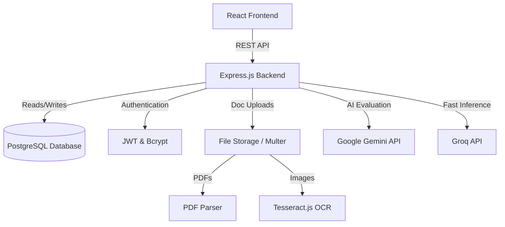

<div align="center">
  <h1>🏢🤝 TenderHub</h1>
  <p><strong>AI-Powered Tender Management & Evaluation Platform</strong></p>

  [](https://reactjs.org/)
  [](https://www.typescriptlang.org/)
  [](https://nodejs.org/)
  [](https://www.postgresql.org/)
  [](https://ai.google.dev/)
  [](https://opensource.org/licenses/MIT)
</div>

<br />

TenderHub is a next-generation, AI-driven platform that revolutionizes the way companies create tenders and vendors apply for them. By leveraging the **Google Gemini API**, **Groq**, and **OCR technology**, TenderHub automatically parses, evaluates, and scores vendor applications against complex tender requirements—saving hundreds of hours of manual review.

---

## ✨ Key Features

### For Companies 🏢
- **Smart Tender Creation**: Define eligibility criteria, budget, completion timelines, and requested documents.
- **AI Tender Generation**: Automatically generate comprehensive NIT (Notice Inviting Tender) PDFs from simple form inputs using AI.
- **Automated Vendor Evaluation**: The platform evaluates incoming applications, scoring them out of 100% based on Technical, Financial, Experience, and Eligibility matches.
- **Fraud & Authenticity Detection**: Automatically flags generic marketing fluff, copy-pasted internet text, or AI-generated responses in vendor submissions.
- **Document Parsing & OCR**: Extracts text from uploaded documents (PDFs, Images) using `tesseract.js` and `pdf-parse` for deep analysis.
- **One-Click Selection**: Close a tender with one click to automatically select the highest-scoring, best-matched vendor.

### For Vendors 👷
- **Seamless Applications**: Apply to active tenders with detailed financial data, past projects, technical capabilities, and document uploads.
- **Real-Time AI Feedback**: Get a detailed AI-generated breakdown of your score, highlighting Strengths, Concerns, Matched Criteria, and Missing items.
- **Application Export**: Automatically generate and download a professional PDF summary of your submitted application.

---

## 🛠️ Technology Stack

### Frontend (Client)
- **Framework**: React 19 with Vite
- **Language**: TypeScript
- **Styling**: SCSS (Component-level modular architecture) & Radix UI
- **Routing**: React Router DOM (v7)
- **State Management**: `@tanstack/react-query`, React Hook Form, Custom Stores
- **Utilities**: `jspdf` (PDF generation), `date-fns`, `zod`

### Backend (Server)
- **Framework**: Node.js with Express.js
- **Language**: TypeScript
- **Database**: PostgreSQL (with `node-pg-migrate` & `pg-pool`)
- **AI Integration**: Google Gemini API (`@google/genai`), Groq SDK
- **Authentication**: JWT (`jsonwebtoken`) & `bcrypt`
- **Document Processing**: `multer` (Uploads), `pdf-parse` (PDF text extraction), `tesseract.js` (OCR)

---

## 🏗️ System Architecture



---

## 🚀 Getting Started

### Prerequisites
- Node.js (v18+)
- PostgreSQL installed and running
- API Keys: [Google Gemini API](https://aistudio.google.com/), [Groq API](https://console.groq.com/)

### 1. Database Setup
Ensure PostgreSQL is running and create a database for the project:
```sql
CREATE DATABASE tenderhub;
```

### 2. Backend Setup
```bash
# Navigate to the backend directory
cd backend

# Install dependencies
npm install

# Configure Environment Variables
cp .env.example .env
# Edit .env with your DB credentials, JWT secret, and API Keys (Gemini, Groq)

# Run Migrations
npm run migrate:create # If setting up fresh migrations
npm run migrate

# Start the development server
npm run dev
```
The backend will run on `http://localhost:5000` (or the port specified in your `.env`).

### 3. Frontend Setup
```bash
# Open a new terminal and navigate to the root directory
cd tendor-management

# Install dependencies
npm install

# Configure Environment Variables
# Create a .env file based on the backend URL if required
# VITE_API_URL=http://localhost:5000/api

# Start the development server
npm run dev
```
The frontend will run on `http://localhost:5173`.

---

## 💡 How to Demo

1. **Company Flow**:
   - Register and log in as a "Company".
   - Navigate to the Dashboard, click **Create Tender**, and fill out the requirements.
   - Wait for vendor applications to be submitted.
   - Review the AI-generated scores and insights. Click "Close Tender & Select Winner" to finalize the decision.

2. **Vendor Flow**:
   - Register and log in as a "Vendor".
   - Browse open tenders and click **Apply Now**.
   - Submit your details along with supporting documents.
   - Once the company closes the tender, check your **My Applications** tab to see your final verdict, score, and detailed AI feedback.

---

## 📂 Project Structure

```text
tendor-management/
├── backend/                  # Express Node.js Server
│   ├── db/                   # PostgreSQL Migrations & Config
│   ├── src/                  # Controllers, Services, Routes
│   ├── uploads/              # Local Document Storage
│   └── package.json
├── src/                      # React Frontend
│   ├── components/           # UI & Layout Components
│   ├── features/             # Feature-specific Views (Company/Vendor)
│   ├── lib/                  # Utilities, API hooks, Stores
│   ├── pages/                # Root Routes
│   └── styles/               # Global SCSS variables & styles
├── package.json
└── README.md
```

---

## 🤝 Contributing

1. Fork the repository
2. Create your feature branch (`git checkout -b feature/AmazingFeature`)
3. Commit your changes (`git commit -m 'Add some AmazingFeature'`)
4. Push to the branch (`git push origin feature/AmazingFeature`)
5. Open a Pull Request

---

<div align="center">
  <i>Built with ❤️ for efficient, transparent, and intelligent tender management.</i>
</div>
